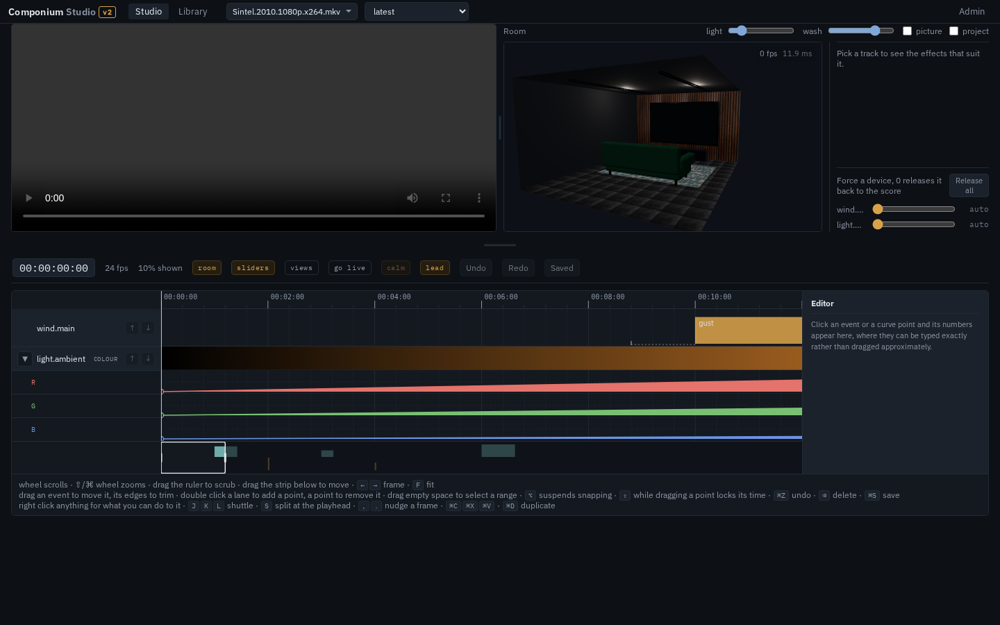

# Componium

**One score, many instruments.** An open-source engine for building 4D home
cinema — motion, light, wind, water, smoke, scent and haptics, all cued to
the film.

Componium reads a *score* (a timeline of cues bound to a piece of media) and
drives your *instruments* (motion rig, fans, DMX fixtures, foggers, misters,
shakers) through a single *conductor* that keeps everything locked to playback
timecode. Instruments are plugins: if you can control it, you can score it.

> Status: **alpha.** One fan has run: an ESP32 driving a 12 V fan through a
> MOSFET, with its start and stall thresholds measured rather than guessed.
> Nothing else has moved. Every other driver is verified over a real socket
> against a real listener, which proves the protocol and proves nothing about
> a fixture, a fogger or a platform. Read
> [docs/wet-and-hot.md](docs/wet-and-hot.md) before pointing it at anything
> that can hurt you.



*The studio: the film, a preview of the room, and the score. Captured from a
running instance over the example score; see
[docs/screenshots/](docs/screenshots/) for what is fixture and what is real.*

## Put it on a server

```sh
curl -fsSL https://raw.githubusercontent.com/Slicit/componium/main/install.sh | bash
```

Four questions, one image, and the studio comes up with an empty library
waiting for a film. `update.sh` beside it keeps it current and never touches
your films or your scores.

It is private: nothing is reachable without signing in. The first
administrator is made on the first start with a password the installer prints
once and leaves in a file on the host, and you add everybody else under
**Admin, Users** as a viewer, an operator or an administrator. See
[docs/installing.md](docs/installing.md).

## Try it with no hardware

```sh
mpv --input-ipc-server=/tmp/mpv.sock film.mkv
componium play -score examples/demo.componium -rig examples/demo-rig.toml
```

Everything in that rig is virtual, so it prints what a real rig would have been
told. `componium node` adds a software instrument over the network, and
`componium studio` opens the timeline in a browser. The studio asks you to
sign in wherever it runs, and makes an administrator the first time with the
password in a file beside its user list.

To generate a score from a film:

```sh
python3 composer/compose.py film.mkv -o film.componium
componium validate -score film.componium -rig my-rig.toml
```

## Commands

| | |
|---|---|
| `componium play` | play a score against a rig |
| `componium rehearse` | dry run against a player, virtual instruments only |
| `componium validate` | check a score, optionally against a rig |
| `componium tune` | measure this machine and player |
| `componium doctor` | print the tuning profile and what it means |
| `componium node` | run a software instrument node |
| `componium studio` | edit a score in a browser |
| `componium import-vision` | move kept descriptions into a database |


## What it is not

- Not a media player. Componium follows a player; it does not replace one.
- Not a 3D video system. Stereoscopic 3D is the display's job.
- Not a lighting protocol. Componium speaks sACN/Art-Net and inherits the
  existing DMX ecosystem rather than competing with it.

## Vocabulary

| Term | Meaning |
|---|---|
| **score** | Timeline of cues and curves bound to one piece of media |
| **instrument** | A driver for one physical device |
| **conductor** | Runtime that keeps every instrument locked to playback timecode |
| **cue** | One timed, discrete event |
| **curve** | A continuous, sampled channel (sway, wind speed, colour) |
| **rig** | The file saying which instruments exist and how to reach them |
| **rehearse** | Dry run with all hardware stubbed out |

## The three hard problems

1. **Clock.** Media players report position by polling, at roughly 1 Hz and
   with jitter. The conductor runs a filter over those samples to maintain a
   sub-frame media clock between them, and resyncs on seek and pause.
2. **Latency compensation.** A DMX fixture responds in ~20 ms; a fan takes
   800–2000 ms to reach speed; a fogger has 1–3 s of lag. Every instrument
   declares its own latency and the conductor dispatches each cue early by
   exactly that much. This is first-class in the protocol, not an afterthought.
3. **Safety.** Instruments declare a safe state and duty-cycle limits. The
   conductor heartbeats at 10 Hz; any instrument that goes 300 ms without one
   fails safe on its own, independently of the conductor.

## Score sketch

```toml
[score]
componium = "0.1"
title = "Dune"
media = { duration = "2:35:12", hash = "sha256:…" }

[[track]]
instrument = "light.ambient"
type = "curve"
interpolation = "linear"
# Channels run 0 to 1, not 0 to 255. An instrument decides what full means.
points = [
  { t = "00:12:04.000", value = { r = 0.0, g = 0.0, b = 0.0 } },
  { t = "00:12:06.500", value = { r = 1.0, g = 0.7, b = 0.35 } },
]

[[track]]
instrument = "wind.main"
type = "cue"
# The numbers an instrument is given live in params. A cue that puts them
# beside `action` still parses, and arrives with nothing in it.
cues = [
  { t = "01:04:22.100", action = "gust", params = { intensity = 0.8 }, duration = "4s" },
]
```

Binding by content hash and duration means a score follows the film, not a
filename.

## Composing scores automatically

Hand-authoring a score takes hours per film. The **composer** is an offline
pipeline that analyses a film — its video, its soundtrack and its subtitle
track — and proposes a complete score for a human to refine.

It is deliberately offline and slow. It never runs during playback; it emits a
score file, and the conductor knows nothing about how that file was made. The
cheapest signals are also the most effective: LFE sub-bass energy maps almost
directly onto shake, per-frame brightness onto ambient light, and SDH subtitle
tracks already carry timestamped semantic labels like `[thunder rumbles]`.

Generated output passes through a limiter that enforces each instrument's
declared limits before it is playable, and a human reviews it in the studio.
AI-assisted, not AI-automatic — the review step is a safety control.

See [LOGBOOK/features/feat-composer.md](LOGBOOK/features/feat-composer.md).

## Documentation

- [LOGBOOK.md](LOGBOOK.md) — what is built, what is next, and what each
  milestone was verified against
- [CONTRIBUTING.md](CONTRIBUTING.md) — how to help, and the CLA
- [docs/screenshots/](docs/screenshots/) — what it looks like, captured rather
  than drawn
- [docs/installing.md](docs/installing.md) — putting it on a server, and
  keeping it up to date
- [docs/running.md](docs/running.md) — the four processes, and the order to
  bring them up in
- [docs/troubleshooting.md](docs/troubleshooting.md) — organised by what you are
  looking at
- [docs/cip.md](docs/cip.md) — Componium Instrument Protocol
- [docs/hardware.md](docs/hardware.md) — what to buy, in what order, and why
- [docs/wet-and-hot.md](docs/wet-and-hot.md) — fog, water, heat and moving mass
- [docs/adr/](docs/adr/) — architecture decisions and why

## Licence

Componium is licensed under the **GNU Affero General Public License v3.0**.
You may use, study, modify and redistribute it, including over a network, on
the condition that derived works are released under the same licence.

The **specification** in [docs/cip.md](docs/cip.md) is separately dedicated to
the public domain under CC0 1.0. Implementing a CIP instrument does not make
your instrument a derived work of Componium — write one in any language, under
any licence you like.

Commercial licences that lift the AGPL's obligations are available separately.

Contributions require a signed agreement before they can be merged; see
[CLA/README.md](CLA/README.md) for why and what it grants.

## Name

After the Componium, a music automaton built by Diederich Nicolaus Winkel in
Amsterdam in 1821 that generated endless variations from a single mechanism.
It is in the Musical Instruments Museum in Brussels.
